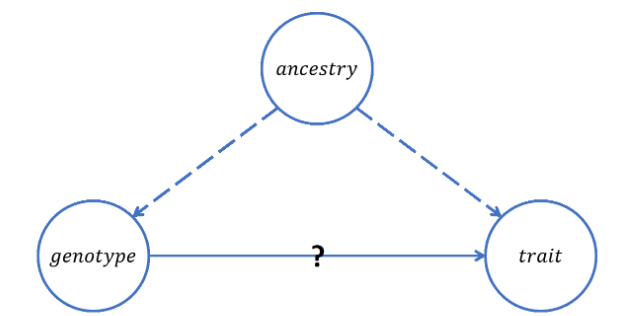

# Introduction to Genetics, GWAS, and Local Ancestry Inference

## Basic Genetics

The human genome consists of 23 pairs of chromosomes, each of which contains millions of nucleotide base pairs joined together in double helixes. The nucleotides adenine (A) and thymine (T) always pair with each other, as do cytosine (C) and guanine (G). At any point along someone’s DNA strand, the sequence of A’s, T’s, C’s, and G’s dictates characteristics of that person. When comparing any two human genomes, the entire strands of nucleotides will be about 99% identical. However, there are small portions of the genome where the sequences vary from person to person, and these places are called genetic variants. Different base pair sequences in these areas are what cause variation among humans at conception.

When humans are conceived, they receive one copy of all 23 chromosomes from their mother, and one copy from their father. Thus, when considering a *single-nucleotide variant* (SNV) at a particular position on any chromosome (depicted in Figure 1), it is the case that a person will have received one allele (A/T, G/C, etc.) from each parent at that position. These two alleles together carry the meaning of that SNV, potentially in the form of an observable trait. Most SNVs are considered biallelic, meaning only two of the four total base pair combinations (A/T, T/A, G/C, and C/G) are possible to be inherited as alleles at a SNV’s particular genomic position. The pair that occurs more commonly across the human population at a SNV is referred to as the major allele, and the less common pair is referred to as the minor allele. Whether a person has received 0, 1, or 2 minor alleles from their parents at a given position determines their *minor allele count* (MAC) at that spot. If the overall frequency of minor alleles for a given SNV is greater than 1% across the human population, it may instead be referred to as a *single-nucleotide polymorphism* (SNP) --  it is an aggregation of data on individuals’ MACs at SNPs in particular that is commonly used as the backbone of genetic studies.

## GWAS and Why Ancestry Matters

In order to learn about how various SNPs are linked to observable human traits, geneticists often conduct what are called *genome-wide association studies* (GWAS). These studies involve gathering genetic and qualitative data on many individuals, some of whom may possess a certain trait of interest. After acquiring the exact sequence of subjects’ genomes, experimenters sift through the sequences for SNPs and record their MACs at each one. Then, regression analysis can be performed to find correlations between individuals’ MACs at various SNPs and their observed traits. This helps experimenters draw conclusions about which SNPs are universally important in determining those traits.

Ancestry, however, can often be a confounding factor that muddles the true relationship between SNPs and observed traits during GWAS, as depicted in Figure 2. Consider, for example, a study attempting to determine which SNPs cause brown hair, but without accounting for German ancestry as a possible confounder. A genotype with SNPs resulting from a German pedigree might show a strong correlation with brown hair if people of German descent are more likely to have brown hair in general. However, concluding that those particular SNPs cause brown hair would be erroneous, since it was really the fact that the people with those certain SNP characteristics were of German origin that made them more likely to have brown hair. Thus, gathering information about subjects’ ancestries is a vital part of GWAS, in that including such data in the regression models helps correct for this type of confounding effect.

## Local Ancestry Inference

In addition to analyzing the confounding effects of one's overall ancestry, it is also useful to examine genetic ancestry at various local windows of the human genome. Our project is focused on the process known as *local ancestry inference* (LAI), wherein mathematical methods are used to infer the ancestral origins of *small segments* of the genome based on the presence, or absence, of genetic variants in these segments.
 

) ](./figures/fig3.png)

Within the academic realm, local ancestry inference is helpful in genetic analyses involving admixed groups: ethnic groups whose genomes have resulted from a recent mixture of two or more geographically-distinct ancestral populations. LAI is particularly useful in classifying the ancestry of diverse cohorts in GWAS, as well as for helping provide evidence of historical human migration patterns through admixture mapping.

Perhaps most influential, however, are the commercial applications of LAI. Organizations such as 23andMe and Ancestry.com offer individual consumers valuable information about their family lineage and predispositions toward various diseases, obtained from GWAS models. These companies use statistical models built on previous aggregations of data for genetic characteristics such as ancestry to offer each customer predictions about these characteristics in accordance with new data from a sample of their DNA. This train-and-predict process provides a perfect example of how machine learning methods can be used in the field of genetics in general, and for LAI in particular. 

