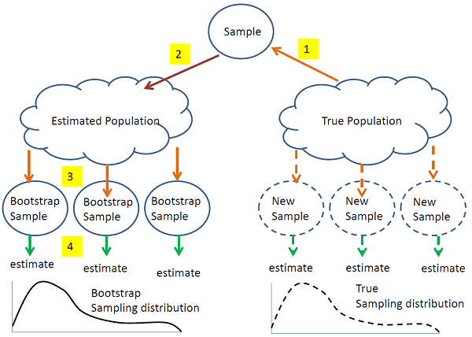

# Bagging and Random Forests

## Ensemble Learning Methods: Bagging

We can mitigate the flaws of a decision tree by aggregating the results of a bunch of trees to narrow in on a decision that is globally optimal. This is essentially the idea behind ensemble learners. There are two main types of ensemble learners, but for the purposes of our project, we will be focusing on bagging, or *Bootstrap AGGregatING.*

As shown in figure 7, Bagging is an ensemble learning technique which helps improve the performance and accuracy of machine learning algorithms by employing a resampling technique known as bootstrapping. From our true population, we take a sample as an estimation of our population of interest. From there, rather than collecting many new samples from the population, we can randomly sample multiple subsets of our collected data to simulate the collection of multiple new samples from the population of interest. Through this process, we can build a model which produces results more similar to the true sampling distribution. Now, extending this idea, we can produce multiple weak, unpruned learners for each bootstrapped sample, combining the predictions made by each of these results to create a more powerful algorithm. 

## The Random Forest Algorithm

)](./figures/fig8.png)

This is the core idea behind random forests! Interestingly, the flaws of a decision tree is what makes the Random Forest such a strong learner – by using many overfit trees, each respectively trained with a different bootstrapped sample, we can aggregate these results to build a more robust model through taking the majority vote from all of the trees within the forest.

We’ve discussed at length why a random forest algorithm is a forest, but what’s random about it? There are two things:

- By using many weak, overspecific decision trees, we can use the process of bagging to select a random bootstrap sample to be used in each tree
- Random forests use a randomly selected subset of predictors for each tree, meaning that rather than searching for the next best split from all the predictors, the tree must choose from the subset of predictors it has in its toolbox.

Through these two important characteristics of random forests, we can *decorrelate* each tree within the Random Forest to mitigate the issues of high variance, greediness, and overfitting previously mentioned. 

